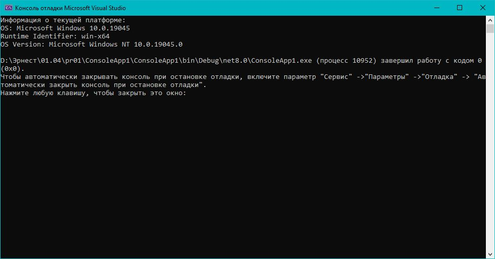

# Практическая работа №1
## Вариант 15: Сравнение компиляций в разных средах

**Задание:**  Напишите программу, которая выводит название текущей платформы, с помощью RuntimeInformation.RuntimeIdentifierили Environment.OSVersion.

### Код решения (Program.cs)

```csharp
using System;
using System.Runtime.InteropServices;

class Program
{
    static void Main()
    {
        Console.WriteLine("Информация о текущей платформе:");
        Console.WriteLine($"OS: {RuntimeInformation.OSDescription}");
        Console.WriteLine($"Runtime Identifier: {RuntimeInformation.RuntimeIdentifier}");
        // Или можно использовать Environment.OSVersion, но RuntimeInformation — более современное.
        Console.WriteLine($"OS Version: {Environment.OSVersion}");
    }
}
```
