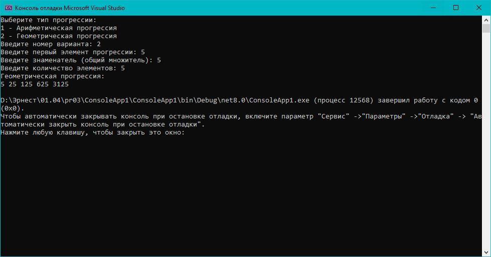

# Практическая работа 3. Управление потоком выполнения в .NET.
## Вариант 15: «Генератор постоянностей»
**Задание:** Напишите программу, которая:

Предлагает пользователю выбрать тип последовательности: 1 - Арифметическая прогрессия, 2 - Геометрическая прогрессия.
Запрашивает начальный элемент, шаг/знаменатель и количество элементов.
используйте switchи выполните цикл for, последовательность и выводит запрошенную последовательность.
Об осуществлении исключения (например, разделение на ноль в геометрической прогрессии).
### Код решения (Program.cs)

```csharp

using System;

class Program
{
    static void Main()
    {
        try
        {
            Console.WriteLine("Выберите тип прогрессии:");
            Console.WriteLine("1 - Арифметическая прогрессия");
            Console.WriteLine("2 - Геометрическая прогрессия");
            Console.Write("Введите номер варианта: ");
            int choice = Convert.ToInt32(Console.ReadLine());

            switch (choice)
            {
                case 1:
                    GenerateArithmeticProgression();
                    break;
                case 2:
                    GenerateGeometricProgression();
                    break;
                default:
                    Console.WriteLine("Некорректный выбор. Пожалуйста, введите 1 или 2.");
                    break;
            }
        }
        catch (FormatException)
        {
            Console.WriteLine("Ошибка: введено некорректное число.");
        }
        catch (OverflowException)
        {
            Console.WriteLine("Ошибка: введенное число слишком большое или слишком маленькое.");
        }
        catch (Exception ex)
        {
            Console.WriteLine($"Некорректная ошибка: {ex.Message}");
        }
    }

    /// <summary>
    /// Метод для генерации и вывода арифметической прогрессии
    /// </summary>
    static void GenerateArithmeticProgression()
    {
        try
        {
            Console.Write("Введите первый элемент прогрессии: ");
            double start = Convert.ToDouble(Console.ReadLine());

            Console.Write("Введите шаг (разность): ");
            double step = Convert.ToDouble(Console.ReadLine());

            Console.Write("Введите количество элементов: ");
            int count = Convert.ToInt32(Console.ReadLine());

            if (count <= 0)
            {
                Console.WriteLine("Количество элементов должно быть положительным числом.");
                return;
            }

            Console.WriteLine("Арифметическая прогрессия:");
            for (int i = 0; i < count; i++)
            {
                double value = start + i * step;
                Console.Write($"{value} ");
            }
            Console.WriteLine(); // перенос строки после вывода
        }
        catch (FormatException)
        {
            Console.WriteLine("Ошибка: введено некорректное число.");
        }
        catch (OverflowException)
        {
            Console.WriteLine("Ошибка: число слишком большое или слишком маленькое.");
        }
        catch (Exception ex)
        {
            Console.WriteLine($"Ошибка: {ex.Message}");
        }
    }

    /// <summary>
    /// Метод для генерации и вывода геометрической прогрессии
    /// </summary>
    static void GenerateGeometricProgression()
    {
        try
        {
            Console.Write("Введите первый элемент прогрессии: ");
            double start = Convert.ToDouble(Console.ReadLine());

            Console.Write("Введите знаменатель (общий множитель): ");
            double ratio = Convert.ToDouble(Console.ReadLine());

            if (ratio == 0)
            {
                Console.WriteLine("Знаменатель не может быть равен нулю.");
                return;
            }

            Console.Write("Введите количество элементов: ");
            int count = Convert.ToInt32(Console.ReadLine());

            if (count <= 0)
            {
                Console.WriteLine("Количество элементов должно быть положительным числом.");
                return;
            }

            Console.WriteLine("Геометрическая прогрессия:");
            double current = start;
            for (int i = 0; i < count; i++)
            {
                Console.Write($"{current} ");
                current *= ratio; // умножаем на знаменатель
            }
            Console.WriteLine(); // перенос строки
        }
        catch (DivideByZeroException)
        {
            Console.WriteLine("Ошибка: деление на ноль недопустимо.");
        }
        catch (FormatException)
        {
            Console.WriteLine("Ошибка: введено некорректное число.");
        }
        catch (OverflowException)
        {
            Console.WriteLine("Ошибка: число слишком большое или слишком маленькое для типа Double.");
        }
        catch (Exception ex)
        {
            Console.WriteLine($"Ошибка: {ex.Message}");
        }
    }
}
```
