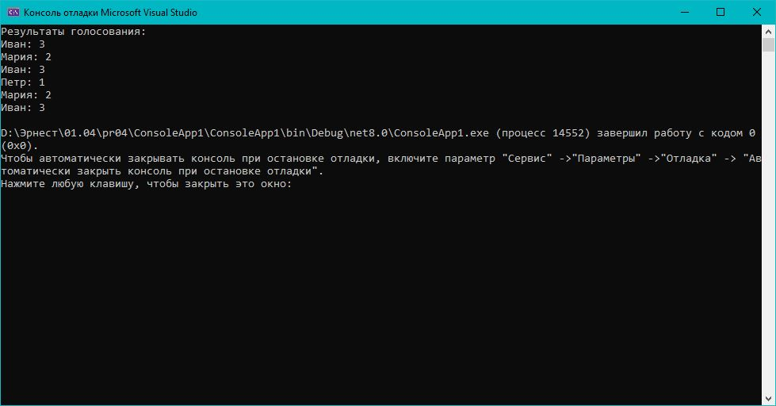

# Практическая работа 4. Реализация и применение структур данных в .NET.
## Вариант 15: Вариант 15: «Система голосования»

Задача: Подсчитать голоса за кандидатов. Используйте словарь.
Пример: Голоса: «Иван», «Мария», «Иван» → Иван: 2, Мария: 1
### Код решения (Program.cs)

```csharp
using System;

class Program
{
    static void Main()
    {
        // Исходный массив голосов
        string[] votes = { "Иван", "Мария", "Иван", "Петр", "Мария", "Иван" };

        // Создаем хэш-таблицу (словарь) для подсчета
        var voteCount = new MyHashTable<string, int>();

        // Подсчет голосов
        foreach (var candidate in votes)
        {
            if (voteCount.ContainsKey(candidate))
            {
                int currentVotes = voteCount.Get(candidate);
                voteCount.Set(candidate, currentVotes + 1);
            }
            else
            {
                voteCount.Add(candidate, 1);
            }
        }

        // Вывод результатов
        Console.WriteLine("Результаты голосования:");
        foreach (var candidate in votes)
        {
            if (voteCount.ContainsKey(candidate))
            {
                Console.WriteLine($"{candidate}: {voteCount.Get(candidate)}");
            }
        }
    }
}
```
