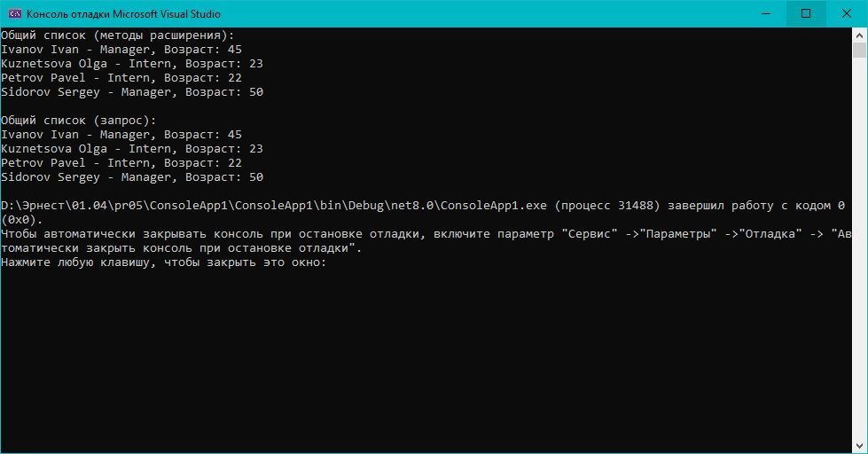

# Практическая работа 5. Основы LINQ to Objects
## Вариант 15: Объединить два руководителя (основной и, например, список стажеров) и вывести общий отсортированный список по фамилиям.


### Код решения (Program.cs)

```csharp
using System;
using System.Collections.Generic;
using System.Linq;

public class Employee
{
    public int Id { get; set; }
    public string FirstName { get; set; }
    public string LastName { get; set; }
    public int Age { get; set; }
    public string Department { get; set; }
    public decimal Salary { get; set; }
    public string Position { get; set; }
}

class Program
{
    static void Main()
    {
        var managers = new List<Employee>
        {
            new Employee { Id = 1, FirstName = "Ivan", LastName = "Ivanov", Age = 45, Department = "IT", Salary = 90000, Position = "Manager" },
            new Employee { Id = 2, FirstName = "Sergey", LastName = "Sidorov", Age = 50, Department = "Finance", Salary = 95000, Position = "Manager" }
        };

        var interns = new List<Employee>
        {
            new Employee { Id = 3, FirstName = "Pavel", LastName = "Petrov", Age = 22, Department = "IT", Salary = 30000, Position = "Intern" },
            new Employee { Id = 4, FirstName = "Olga", LastName = "Kuznetsova", Age = 23, Department = "HR", Salary = 35000, Position = "Intern" }
        };

        // Способ 1: методы расширения
        var combinedMethod = managers.Concat(interns)
                                     .OrderBy(e => e.LastName)
                                     .ToList();

        Console.WriteLine("Общий список (методы расширения):");
        foreach (var emp in combinedMethod)
        {
            Console.WriteLine($"{emp.LastName} {emp.FirstName} — {emp.Position}, Возраст: {emp.Age}");
        }

        Console.WriteLine();

        // Способ 2: LINQ-запрос
        var combinedQuery = from m in managers
                            select m
                            into m2
                            from i in interns
                            select new Employee
                            {
                                Id = i.Id,
                                FirstName = i.FirstName,
                                LastName = i.LastName,
                                Age = i.Age,
                                Department = i.Department,
                                Salary = i.Salary,
                                Position = i.Position
                            };

        var combinedList = managers.Concat(interns)
                                   .OrderBy(e => e.LastName)
                                   .ToList();

        Console.WriteLine("Общий список (запрос):");
        foreach (var emp in combinedList)
        {
            Console.WriteLine($"{emp.LastName} {emp.FirstName} — {emp.Position}, Возраст: {emp.Age}");
        }
    }
}
```


