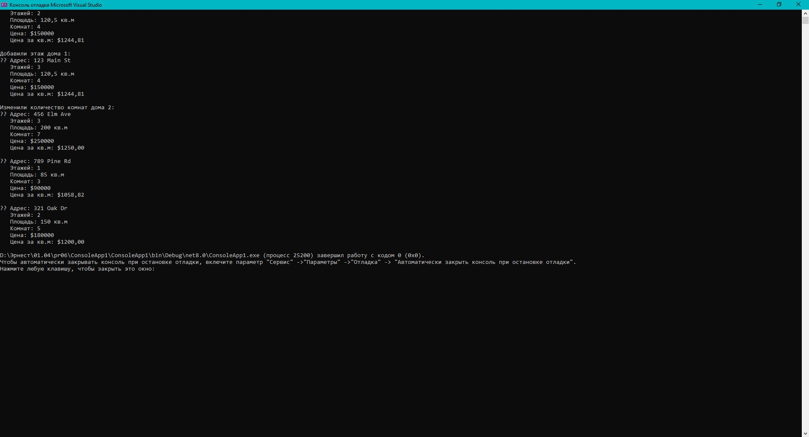

# Практическая работа 6. Создание классов и объектов на C#.
## Вариант 15: Класс «Дом»

**Задание:** Создать класс House, представляющий дом. Должен держать адрес, количество этажей, площадь, количество комнат, цену. Реализовать методы расчета цены за квадратный метр, добавления этажей, изменения количества комнат.


### Код решения (Program.cs)

```csharp
using System;

namespace RealEstate
{
    public class House
    {
        // Поля
        private string address;
        private int floors;
        private double area; // площадь в кв. метрах
        private int rooms;
        private decimal price;

        // Свойства с валидацией
        public string Address
        {
            get { return address; }
            set
            {
                if (string.IsNullOrWhiteSpace(value))
                    throw new ArgumentException("Address cannot be empty");
                address = value;
            }
        }

        public int Floors
        {
            get { return floors; }
            set
            {
                if (value < 1)
                    throw new ArgumentException("Number of floors must be at least 1");
                floors = value;
            }
        }

        public double Area
        {
            get { return area; }
            set
            {
                if (value <= 0)
                    throw new ArgumentException("Area must be positive");
                area = value;
            }
        }

        public int Rooms
        {
            get { return rooms; }
            set
            {
                if (value < 1)
                    throw new ArgumentException("Number of rooms must be at least 1");
                rooms = value;
            }
        }

        public decimal Price
        {
            get { return price; }
            set
            {
                if (value < 0)
                    throw new ArgumentException("Price cannot be negative");
                price = value;
            }
        }

        // Конструктор по умолчанию
        public House() { }

        // Конструктор с параметрами
        public House(string address, int floors, double area, int rooms, decimal price)
        {
            Address = address;
            Floors = floors;
            Area = area;
            Rooms = rooms;
            Price = price;
        }

        // Метод: расчет стоимости за квадратный метр
        public decimal GetPricePerSquareMeter()
        {
            if (Area == 0)
                throw new InvalidOperationException("Area must be greater than zero");
            return Price / (decimal)Area;
        }

        // Метод: добавление этажа
        public void AddFloor()
        {
            Floors++;
        }

        // Метод: изменение количества комнат
        public void ChangeRooms(int newRoomCount)
        {
            if (newRoomCount < 1)
                throw new ArgumentException("Number of rooms must be at least 1");
            Rooms = newRoomCount;
        }

        // Метод: вывод информации о доме
        public void DisplayInfo()
        {
            Console.WriteLine($"🏠 Адрес: {Address}");
            Console.WriteLine($"   Этажей: {Floors}");
            Console.WriteLine($"   Площадь: {Area} кв.м");
            Console.WriteLine($"   Комнат: {Rooms}");
            Console.WriteLine($"   Цена: ${Price}");
            Console.WriteLine($"   Цена за кв.м: ${GetPricePerSquareMeter():F2}");
        }
    }

    class Program
    {
        static void Main(string[] args)
        {
            // Создаем несколько объектов дома
            House house1 = new House("123 Main St", 2, 120.5, 4, 150000m);
            House house2 = new House("456 Elm Ave", 3, 200.0, 6, 250000m);
            House house3 = new House("789 Pine Rd", 1, 85.0, 3, 90000m);
            House house4 = new House("321 Oak Dr", 2, 150.0, 5, 180000m);

            // Работа с объектами
            house1.DisplayInfo();
            Console.WriteLine();

            // Добавим этаж
            house1.AddFloor();
            Console.WriteLine("Добавили этаж дома 1:");
            house1.DisplayInfo();
            Console.WriteLine();

            // Изменим количество комнат
            house2.ChangeRooms(7);
            Console.WriteLine("Изменили количество комнат дома 2:");
            house2.DisplayInfo();
            Console.WriteLine();

            // Вывод информации о других домах
            house3.DisplayInfo();
            Console.WriteLine();
            house4.DisplayInfo();
        }
    }
}
```
