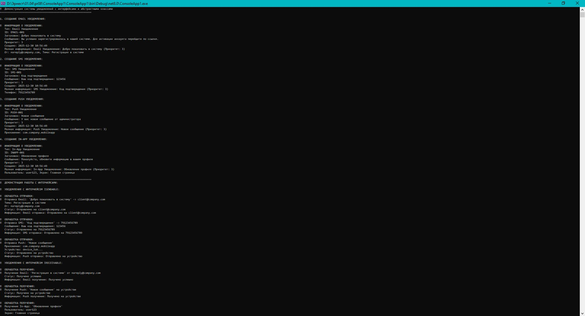

# Практическая работа 8. Создание интерфейсов и абстрактных классов в C#.
## Вариант 15: Система регистрации

**Задание:** Задача: Создать систему для управления различными типами документов с использованием интерфейсов и абстрактных классов.

### Код решения (Program.cs)

```csharp
using System;
using System.Collections.Generic;
using System.Linq;
using System.Text;

namespace NotificationSystem
{
    /// <summary>
    /// Интерфейс для объектов, которые могут быть отправлены
    /// </summary>
    public interface ISendable
    {
        /// <summary>
        /// Отправить уведомление
        /// </summary>
        /// <param name="recipient">Получатель</param>
        /// <returns>Результат отправки</returns>
        bool Send(string recipient);

        /// <summary>
        /// Получить статус отправки
        /// </summary>
        string SendStatus { get; }

        /// <summary>
        /// Получить информацию об отправке
        /// </summary>
        string GetSendInfo();
    }

    /// <summary>
    /// Интерфейс для объектов, которые могут быть получены
    /// </summary>
    public interface IReceivable
    {
        /// <summary>
        /// Получить уведомление
        /// </summary>
        /// <returns>Результат получения</returns>
        bool Receive();

        /// <summary>
        /// Получить статус получения
        /// </summary>
        string ReceiveStatus { get; }

        /// <summary>
        /// Получить информацию о получении
        /// </summary>
        string GetReceiveInfo();
    }

    /// <summary>
    /// Интерфейс для объектов, которые могут быть прочитаны
    /// </summary>
    public interface IReadable
    {
        /// <summary>
        /// Прочитать уведомление
        /// </summary>
        /// <returns>Результат чтения</returns>
        bool Read();

        /// <summary>
        /// Проверить, прочитано ли уведомление
        /// </summary>
        bool IsRead { get; }

        /// <summary>
        /// Получить информацию о чтении
        /// </summary>
        string GetReadInfo();
    }

    /// <summary>
    /// Интерфейс для объектов, которые могут быть архивированы
    /// </summary>
    public interface IArchivable
    {
        /// <summary>
        
        /// </summary>
        /// <returns>Результат архивации</returns>
        bool Archive();

        /// <summary>
        /// Разархивировать уведомление
        /// </summary>
        /// <returns>Результат разархивации</returns>
        bool Unarchive();

        /// <summary>
        /// Проверить, архивировано ли уведомление
        /// </summary>
        bool IsArchived { get; }

        /// <summary>
        /// Получить информацию об архивации
        /// </summary>
        string GetArchiveInfo();
    }

    /// <summary>
    /// Абстрактный базовый класс для всех уведомлений
    /// Отношение "есть-а" (Notification "есть-а" тип уведомления)
    /// </summary>
    public abstract class Notification
    {
        // Поля абстрактного класса
        private string _id;
        private DateTime _createdDate;
        private string _title;
        private string _message;
        private int _priority;

        // Свойства с защищенными сеттерами
        public string Id
        {
            get { return _id; }
            protected set { _id = value; }
        }

        public DateTime CreatedDate
        {
            get { return _createdDate; }
            protected set { _createdDate = value; }
        }

        public string Title
        {
            get { return _title; }
            set
            {
                if (string.IsNullOrWhiteSpace(value))
                    throw new ArgumentException("Заголовок не может быть пустым");
                _title = value;
            }
        }

        public string Message
        {
            get { return _message; }
            set
            {
                if (string.IsNullOrWhiteSpace(value))
                    throw new ArgumentException("Сообщение не может быть пустым");
                _message = value;
            }
        }

        public int Priority
        {
            get { return _priority; }
            set
            {
                if (value < 1 || value > 5)
                    throw new ArgumentException("Приоритет должен быть от 1 до 5");
                _priority = value;
            }
        }

        // Конструктор абстрактного класса
        protected Notification(string id, string title, string message, int priority = 3)
        {
            Id = id;
            CreatedDate = DateTime.Now;
            Title = title;
            Message = message;
            Priority = priority;
        }

        // Абстрактный метод - должен быть реализован в производных классах
        public abstract string GetNotificationType();

        // Виртуальный метод - может быть переопределен в производных классах
        public virtual string GetFullInfo()
        {
            return $"{GetNotificationType()}: {Title} (Приоритет: {Priority})";
        }

        // Обычный метод с реализацией
        public string GetCreationInfo()
        {
            return $"Создано: {CreatedDate:yyyy-MM-dd HH:mm:ss}";
        }

        // Статический метод
        public static string GetNotificationSystemInfo()
        {
            return "Система уведомлений v1.0";
        }
    }

    /// <summary>
    /// Класс для Email-уведомлений
    /// Реализует ISendable и IReceivable
    /// Отношение "может-делать" (EmailNotification "может-делать" отправку и получение)
    /// </summary>
    public class EmailNotification : Notification, ISendable, IReceivable, IArchivable
    {
        // Специфичные поля для Email
        private string _sender;
        private string _recipient;
        private string _subject;
        private bool _isSent;
        private bool _isReceived;
        private bool _isArchived;

        public string Sender
        {
            get { return _sender; }
            set { _sender = value; }
        }

        public string Recipient
        {
            get { return _recipient; }
            set { _recipient = value; }
        }

        public string Subject
        {
            get { return _subject; }
            set { _subject = value; }
        }

        // Реализация ISendable
        public string SendStatus { get; private set; } = "Не отправлено";

        public bool Send(string recipient)
        {
            Recipient = recipient;

            // Симуляция отправки
            if (string.IsNullOrWhiteSpace(recipient) || !recipient.Contains("@"))
            {
                SendStatus = "Ошибка: неверный email адрес";
                return false;
            }

            if (string.IsNullOrWhiteSpace(Subject))
            {
                SendStatus = "Ошибка: отсутствует тема письма";
                return false;
            }

            _isSent = true;
            SendStatus = $"Отправлено на {recipient}";

            Console.WriteLine($"📧 Отправка Email: '{Title}' -> {recipient}");
            Console.WriteLine($"   Тема: {Subject}");
            Console.WriteLine($"   От: {Sender}");

            return true;
        }

        public string GetSendInfo()
        {
            return $"Email отправка: {SendStatus}";
        }

        // Реализация IReceivable
        public string ReceiveStatus { get; private set; } = "Не получено";

        public bool Receive()
        {
            if (!_isSent)
            {
                ReceiveStatus = "Нельзя получить неотправленное письмо";
                return false;
            }

            _isReceived = true;
            ReceiveStatus = "Получено успешно";

            Console.WriteLine($"📨 Получение Email: '{Subject}' от {Sender}");

            return true;
        }

        public string GetReceiveInfo()
        {
            return $"Email получение: {ReceiveStatus}";
        }

        // Реализация IArchivable
        public bool IsArchived => _isArchived;

        public bool Archive()
        {
            if (_isArchived)
            {
                Console.WriteLine($"ℹ️ Email '{Title}' уже архивирован");
                return false;
            }

            _isArchived = true;
            Console.WriteLine($"🗄️ Архивация Email: '{Title}'");
            return true;
        }

        public bool Unarchive()
        {
            if (!_isArchived)
            {
                Console.WriteLine($"ℹ️ Email '{Title}' не архивирован");
                return false;
            }

            _isArchived = false;
            Console.WriteLine($"📂 Разархивация Email: '{Title}'");
            return true;
        }

        public string GetArchiveInfo()
        {
            return $"Email архив: {(IsArchived ? "Архивирован" : "Не архивирован")}";
        }

        // Конструктор
        public EmailNotification(string id, string title, string message, string sender, string subject)
            : base(id, title, message)
        {
            Sender = sender;
            Subject = subject;
            _isSent = false;
            _isReceived = false;
            _isArchived = false;
        }

        // Реализация абстрактного метода
        public override string GetNotificationType()
        {
            return "Email Уведомление";
        }

        // Переопределение виртуального метода
        public override string GetFullInfo()
        {
            return $"{base.GetFullInfo()}\n   От: {Sender}, Тема: {Subject}";
        }
    }

    /// <summary>
    /// Класс для SMS-уведомлений
    /// Реализует ISendable и IReadable
    /// </summary>
    public class SMSNotification : Notification, ISendable, IReadable
    {
        // Специфичные поля для SMS
        private string _phoneNumber;
        private bool _isRead;
        private bool _isSent;

        public string PhoneNumber
        {
            get { return _phoneNumber; }
            set
            {
                if (string.IsNullOrWhiteSpace(value) || value.Length < 10)
                    throw new ArgumentException("Номер телефона должен содержать минимум 10 цифр");
                _phoneNumber = value;
            }
        }

        // Реализация ISendable
        public string SendStatus { get; private set; } = "Не отправлено";

        public bool Send(string recipient)
        {
            PhoneNumber = recipient;

            // Симуляция отправки SMS
            if (string.IsNullOrWhiteSpace(recipient) || !recipient.All(char.IsDigit))
            {
                SendStatus = "Ошибка: неверный номер телефона";
                return false;
            }

            _isSent = true;
            SendStatus = $"Отправлено на {recipient}";

            Console.WriteLine($"📱 Отправка SMS: '{Title}' -> {recipient}");
            Console.WriteLine($"   Сообщение: {Message}");

            return true;
        }

        public string GetSendInfo()
        {
            return $"SMS отправка: {SendStatus}";
        }

        // Реализация IReadable
        public bool IsRead => _isRead;

        public bool Read()
        {
            if (!_isSent)
            {
                Console.WriteLine($"❌ Нельзя прочитать неотправленное SMS");
                return false;
            }

            _isRead = true;
            Console.WriteLine($"📖 Чтение SMS: '{Title}'");
            Console.WriteLine($"   Содержимое: {Message}");

            return true;
        }

        public string GetReadInfo()
        {
            return $"SMS чтение: {(IsRead ? "Прочитано" : "Не прочитано")}";
        }

        // Конструктор
        public SMSNotification(string id, string title, string message, string phoneNumber)
            : base(id, title, message)
        {
            PhoneNumber = phoneNumber;
            _isRead = false;
            _isSent = false;
        }

        // Реализация абстрактного метода
        public override string GetNotificationType()
        {
            return "SMS Уведомление";
        }

        // Переопределение виртуального метода
        public override string GetFullInfo()
        {
            return $"{base.GetFullInfo()}\n   Телефон: {PhoneNumber}";
        }
    }

    /// <summary>
    /// Класс для Push-уведомлений
    /// Реализует ISendable, IReceivable и IReadable
    /// </summary>
    public class PushNotification : Notification, ISendable, IReceivable, IReadable, IArchivable
    {
        // Специфичные поля для Push
        private string _deviceToken;
        private string _appId;
        private bool _isSent;
        private bool _isReceived;
        private bool _isRead;
        private bool _isArchived;

        public string DeviceToken
        {
            get { return _deviceToken; }
            set { _deviceToken = value; }
        }

        public string AppId
        {
            get { return _appId; }
            set { _appId = value; }
        }

        // Реализация ISendable
        public string SendStatus { get; private set; } = "Не отправлено";

        public bool Send(string recipient)
        {
            DeviceToken = recipient;

            // Симуляция отправки Push
            if (string.IsNullOrWhiteSpace(recipient))
            {
                SendStatus = "Ошибка: отсутствует device token";
                return false;
            }

            _isSent = true;
            SendStatus = $"Отправлено на устройство";

            Console.WriteLine($"📲 Отправка Push: '{Title}'");
            Console.WriteLine($"   Приложение: {AppId}");
            Console.WriteLine($"   Устройство: {DeviceToken.Substring(0, Math.Min(10, DeviceToken.Length))}...");

            return true;
        }

        public string GetSendInfo()
        {
            return $"Push отправка: {SendStatus}";
        }

        // Реализация IReceivable
        public string ReceiveStatus { get; private set; } = "Не получено";

        public bool Receive()
        {
            if (!_isSent)
            {
                ReceiveStatus = "Нельзя получить неотправленное уведомление";
                return false;
            }

            _isReceived = true;
            ReceiveStatus = "Получено на устройстве";

            Console.WriteLine($"📲 Получение Push: '{Title}' на устройстве");

            return true;
        }

        public string GetReceiveInfo()
        {
            return $"Push получение: {ReceiveStatus}";
        }

        // Реализация IReadable
        public bool IsRead => _isRead;

        public bool Read()
        {
            if (!_isReceived)
            {
                Console.WriteLine($"❌ Нельзя прочитать неполученное Push-уведомление");
                return false;
            }

            _isRead = true;
            Console.WriteLine($"📖 Чтение Push: '{Title}'");
            Console.WriteLine($"   Содержимое: {Message}");

            return true;
        }

        public string GetReadInfo()
        {
            return $"Push чтение: {(IsRead ? "Прочитано" : "Не прочитано")}";
        }

        // Реализация IArchivable
        public bool IsArchived => _isArchived;

        public bool Archive()
        {
            if (_isArchived)
            {
                Console.WriteLine($"ℹ️ Push '{Title}' уже архивирован");
                return false;
            }

            _isArchived = true;
            Console.WriteLine($"🗄️ Архивация Push: '{Title}'");
            return true;
        }

        public bool Unarchive()
        {
            if (!_isArchived)
            {
                Console.WriteLine($"ℹ️ Push '{Title}' не архивирован");
                return false;
            }

            _isArchived = false;
            Console.WriteLine($"📂 Разархивация Push: '{Title}'");
            return true;
        }

        public string GetArchiveInfo()
        {
            return $"Push архив: {(IsArchived ? "Архивирован" : "Не архивирован")}";
        }

        // Конструктор
        public PushNotification(string id, string title, string message, string deviceToken, string appId)
            : base(id, title, message)
        {
            DeviceToken = deviceToken;
            AppId = appId;
            _isSent = false;
            _isReceived = false;
            _isRead = false;
            _isArchived = false;
        }

        // Реализация абстрактного метода
        public override string GetNotificationType()
        {
            return "Push Уведомление";
        }

        // Переопределение виртуального метода
        public override string GetFullInfo()
        {
            return $"{base.GetFullInfo()}\n   Приложение: {AppId}";
        }
    }

    /// <summary>
    /// Класс для In-App уведомлений
    /// Реализует IReceivable и IReadable
    /// </summary>
    public class InAppNotification : Notification, IReceivable, IReadable, IArchivable
    {
        // Специфичные поля для In-App
        private string _userId;
        private string _screenName;
        private bool _isReceived;
        private bool _isRead;
        private bool _isArchived;

        public string UserId
        {
            get { return _userId; }
            set { _userId = value; }
        }

        public string ScreenName
        {
            get { return _screenName; }
            set { _screenName = value; }
        }

        // Реализация IReceivable
        public string ReceiveStatus { get; private set; } = "Не получено";

        public bool Receive()
        {
            if (string.IsNullOrWhiteSpace(UserId))
            {
                ReceiveStatus = "Ошибка: отсутствует User ID";
                return false;
            }

            _isReceived = true;
            ReceiveStatus = "Получено в приложении";

            Console.WriteLine($"📱 Получение In-App: '{Title}'");
            Console.WriteLine($"   Пользователь: {UserId}");
            Console.WriteLine($"   Экран: {ScreenName}");

            return true;
        }

        public string GetReceiveInfo()
        {
            return $"In-App получение: {ReceiveStatus}";
        }

        // Реализация IReadable
        public bool IsRead => _isRead;

        public bool Read()
        {
            if (!_isReceived)
            {
                Console.WriteLine($"❌ Нельзя прочитать неполученное In-App уведомление");
                return false;
            }

            _isRead = true;
            Console.WriteLine($"📖 Чтение In-App: '{Title}'");
            Console.WriteLine($"   Содержимое: {Message}");

            return true;
        }

        public string GetReadInfo()
        {
            return $"In-App чтение: {(IsRead ? "Прочитано" : "Не прочитано")}";
        }

        // Реализация IArchivable
        public bool IsArchived => _isArchived;

        public bool Archive()
        {
            if (_isArchived)
            {
                Console.WriteLine($"ℹ️ In-App '{Title}' уже архивирован");
                return false;
            }

            _isArchived = true;
            Console.WriteLine($"🗄️ Архивация In-App: '{Title}'");
            return true;
        }

        public bool Unarchive()
        {
            if (!_isArchived)
            {
                Console.WriteLine($"ℹ️ In-App '{Title}' не архивирован");
                return false;
            }

            _isArchived = false;
            Console.WriteLine($"📂 Разархивация In-App: '{Title}'");
            return true;
        }

        public string GetArchiveInfo()
        {
            return $"In-App архив: {(IsArchived ? "Архивирован" : "Не архивирован")}";
        }

        // Конструктор
        public InAppNotification(string id, string title, string message, string userId, string screenName)
            : base(id, title, message)
        {
            UserId = userId;
            ScreenName = screenName;
            _isReceived = false;
            _isRead = false;
            _isArchived = false;
        }

        // Реализация абстрактного метода
        public override string GetNotificationType()
        {
            return "In-App Уведомление";
        }

        // Переопределение виртуального метода
        public override string GetFullInfo()
        {
            return $"{base.GetFullInfo()}\n   Пользователь: {UserId}, Экран: {ScreenName}";
        }
    }

    /// <summary>
    /// Статический класс для работы с уведомлениями
    /// </summary>
    public static class NotificationManager
    {
        public static void DisplayNotificationInfo(Notification notification)
        {
            Console.WriteLine($"\n📋 ИНФОРМАЦИЯ О УВЕДОМЛЕНИИ:");
            Console.WriteLine($"   Тип: {notification.GetNotificationType()}");
            Console.WriteLine($"   ID: {notification.Id}");
            Console.WriteLine($"   Заголовок: {notification.Title}");
            Console.WriteLine($"   Сообщение: {notification.Message}");
            Console.WriteLine($"   Приоритет: {notification.Priority}");
            Console.WriteLine($"   {notification.GetCreationInfo()}");
            Console.WriteLine($"   Полная информация: {notification.GetFullInfo()}");
        }

        public static void ProcessSendable(ISendable sendable, string recipient)
        {
            Console.WriteLine($"\n🚀 ОБРАБОТКА ОТПРАВКИ:");
            sendable.Send(recipient);
            Console.WriteLine($"   Статус: {sendable.SendStatus}");
            Console.WriteLine($"   Информация: {sendable.GetSendInfo()}");
        }

        public static void ProcessReceivable(IReceivable receivable)
        {
            Console.WriteLine($"\n📨 ОБРАБОТКА ПОЛУЧЕНИЯ:");
            receivable.Receive();
            Console.WriteLine($"   Статус: {receivable.ReceiveStatus}");
            Console.WriteLine($"   Информация: {receivable.GetReceiveInfo()}");
        }

        public static void ProcessReadable(IReadable readable)
        {
            Console.WriteLine($"\n📖 ОБРАБОТКА ЧТЕНИЯ:");
            readable.Read();
            Console.WriteLine($"   Прочитано: {readable.IsRead}");
            Console.WriteLine($"   Информация: {readable.GetReadInfo()}");
        }

        public static void ProcessArchivable(IArchivable archivable, bool archive = true)
        {
            Console.WriteLine($"\n🗄️ ОБРАБОТКА АРХИВАЦИИ:");
            if (archive)
                archivable.Archive();
            else
                archivable.Unarchive();
            Console.WriteLine($"   Архивировано: {archivable.IsArchived}");
            Console.WriteLine($"   Информация: {archivable.GetArchiveInfo()}");
        }

        public static void DisplayStatistics(List<Notification> notifications)
        {
            Console.WriteLine("\n📊 СТАТИСТИКА УВЕДОМЛЕНИЙ:");

            var total = notifications.Count;
            var emails = notifications.OfType<EmailNotification>().Count();
            var sms = notifications.OfType<SMSNotification>().Count();
            var push = notifications.OfType<PushNotification>().Count();
            var inApp = notifications.OfType<InAppNotification>().Count();

            var sendable = notifications.OfType<ISendable>().Count();
            var receivable = notifications.OfType<IReceivable>().Count();
            var readable = notifications.OfType<IReadable>().Count();
            var archivable = notifications.OfType<IArchivable>().Count();

            Console.WriteLine($"   Всего уведомлений: {total}");
            Console.WriteLine($"   Email уведомлений: {emails}");
            Console.WriteLine($"   SMS уведомлений: {sms}");
            Console.WriteLine($"   Push уведомлений: {push}");
            Console.WriteLine($"   In-App уведомлений: {inApp}");
            Console.WriteLine($"   Отправляемых: {sendable}");
            Console.WriteLine($"   Получаемых: {receivable}");
            Console.WriteLine($"   Читаемых: {readable}");
            Console.WriteLine($"   Архивируемых: {archivable}");
        }
    }

    /// <summary>
    /// Главный класс программы
    /// </summary>
    class Program
    {
        static void Main(string[] args)
        {
            Console.OutputEncoding = System.Text.Encoding.UTF8;
            Console.WriteLine("🎯 Демонстрация системы уведомлений с интерфейсами и абстрактными классами");
            Console.WriteLine("=".PadRight(60, '='));

            // Создание списка уведомлений
            var notifications = new List<Notification>();

            // 1. Создание Email уведомления
            Console.WriteLine("\n1. СОЗДАНИЕ EMAIL УВЕДОМЛЕНИЯ:");
            var emailNotification = new EmailNotification(
                id: "EMAIL-001",
                title: "Добро пожаловать в систему",
                message: "Вы успешно зарегистрировались в нашей системе. Для активации аккаунта перейдите по ссылке.",
                sender: "noreply@company.com",
                subject: "Регистрация в системе"
            );
            notifications.Add(emailNotification);
            NotificationManager.DisplayNotificationInfo(emailNotification);

            // 2. Создание SMS уведомления
            Console.WriteLine("\n2. СОЗДАНИЕ SMS УВЕДОМЛЕНИЯ:");
            var smsNotification = new SMSNotification(
                id: "SMS-001",
                title: "Код подтверждения",
                message: "Ваш код подтверждения: 123456",
                phoneNumber: "79123456789"
            );
            notifications.Add(smsNotification);
            NotificationManager.DisplayNotificationInfo(smsNotification);

            // 3. Создание Push уведомления
            Console.WriteLine("\n3. СОЗДАНИЕ PUSH УВЕДОМЛЕНИЯ:");
            var pushNotification = new PushNotification(
                id: "PUSH-001",
                title: "Новое сообщение",
                message: "У вас новое сообщение от администратора",
                deviceToken: "abc123def456ghi789",
                appId: "com.company.mobileapp"
            );
            notifications.Add(pushNotification);
            NotificationManager.DisplayNotificationInfo(pushNotification);

            // 4. Создание In-App уведомления
            Console.WriteLine("\n4. СОЗДАНИЕ IN-APP УВЕДОМЛЕНИЯ:");
            var inAppNotification = new InAppNotification(
                id: "INAPP-001",
                title: "Обновление профиля",
                message: "Пожалуйста, обновите информацию в вашем профиле",
                userId: "user123",
                screenName: "Главная страница"
            );
            notifications.Add(inAppNotification);
            NotificationManager.DisplayNotificationInfo(inAppNotification);

            Console.WriteLine("\n" + "=".PadRight(60, '='));
            Console.WriteLine("🚀 ДЕМОНСТРАЦИЯ РАБОТЫ С ИНТЕРФЕЙСАМИ:");

            // Демонстрация ISendable
            Console.WriteLine("\n📤 УВЕДОМЛЕНИЯ С ИНТЕРФЕЙСОМ ISENDABLE:");
            var sendableNotifications = notifications.OfType<ISendable>().ToList();
            foreach (var sendable in sendableNotifications)
            {
                if (sendable is EmailNotification email)
                {
                    NotificationManager.ProcessSendable(sendable, "client@company.com");
                }
                else if (sendable is SMSNotification sms)
                {
                    NotificationManager.ProcessSendable(sendable, "79123456789");
                }
                else if (sendable is PushNotification push)
                {
                    NotificationManager.ProcessSendable(sendable, "device_token_123");
                }
            }

            // Демонстрация IReceivable
            Console.WriteLine("\n📨 УВЕДОМЛЕНИЯ С ИНТЕРФЕЙСОМ IRECEIVABLE:");
            var receivableNotifications = notifications.OfType<IReceivable>().ToList();
            foreach (var receivable in receivableNotifications)
            {
                NotificationManager.ProcessReceivable(receivable);
            }

            // Демонстрация IReadable
            Console.WriteLine("\n📖 УВЕДОМЛЕНИЯ С ИНТЕРФЕЙСОМ IREADABLE:");
            var readableNotifications = notifications.OfType<IReadable>().ToList();
            foreach (var readable in readableNotifications)
            {
                NotificationManager.ProcessReadable(readable);
            }

            // Демонстрация IArchivable
            Console.WriteLine("\n🗄️ УВЕДОМЛЕНИЯ С ИНТЕРФЕЙСОМ IARCHIVABLE:");
            var archivableNotifications = notifications.OfType<IArchivable>().ToList();
            foreach (var archivable in archivableNotifications)
            {
                NotificationManager.ProcessArchivable(archivable, true);
            }

            // Демонстрация разной работы с уведомлениями
            Console.WriteLine("\n" + "=".PadRight(60, '='));
            Console.WriteLine("🔄 РАЗНАЯ ОБРАБОТКА УВЕДОМЛЕНИЙ:");

            // Обработка через базовый класс
            Console.WriteLine("\n🔹 ОБРАБОТКА ЧЕРЕЗ БАЗОВЫЙ КЛАСС Notification:");
            foreach (var notification in notifications)
            {
                Console.WriteLine($"   - {notification.GetNotificationType()}: {notification.Title}");
            }

            // Обработка через конкретные интерфейсы
            Console.WriteLine("\n🔹 ОБРАБОТКА ЧЕРЕЗ КОНКРЕТНЫЕ ИНТЕРФЕЙСЫ:");

            // Отправка всех отправляемых уведомлений
            Console.WriteLine("   Отправка всех отправляемых уведомлений:");
            foreach (var sendable in sendableNotifications)
            {
                Console.WriteLine($"   ✓ {sendable.GetSendInfo()}");
            }

            // Архивация всех архивируемых уведомлений
            Console.WriteLine("\n   Архивация всех архивируемых уведомлений:");
            foreach (var archivable in archivableNotifications)
            {
                Console.WriteLine($"   ✓ {archivable.GetArchiveInfo()}");
            }

            // Показ статистики
            NotificationManager.DisplayStatistics(notifications);

            // Демонстрация полиморфизма
            Console.WriteLine("\n" + "=".PadRight(60, '='));
            Console.WriteLine("🎭 ДЕМОНСТРАЦИЯ ПОЛИМОРФИЗМА:");

            // Массив базового типа, содержащий разные типы уведомлений
            Notification[] notificationArray = new Notification[]
            {
                emailNotification,
                smsNotification,
                pushNotification,
                inAppNotification
            };

            foreach (var notification in notificationArray)
            {
                Console.WriteLine($"\n🔹 Вызов GetNotificationType() для {notification.GetType().Name}:");
                Console.WriteLine($"   Результат: {notification.GetNotificationType()}");

                Console.WriteLine($"\n🔹 Вызов GetFullInfo() для {notification.GetType().Name}:");
                Console.WriteLine($"   Результат: {notification.GetFullInfo()}");
            }

            // Демонстрация работы с интерфейсами через общие методы
            Console.WriteLine("\n" + "=".PadRight(60, '='));
            Console.WriteLine("🛠️ ОБЩИЕ МЕТОДЫ ДЛЯ РАБОТЫ С ИНТЕРФЕЙСАМИ:");

            ProcessNotification(emailNotification);
            ProcessNotification(smsNotification);
            ProcessNotification(pushNotification);
            ProcessNotification(inAppNotification);

            Console.WriteLine("\n" + "=".PadRight(60, '='));
            Console.WriteLine("🏁 ДЕМОНСТРАЦИЯ ЗАВЕРШЕНА!");
            Console.WriteLine("Нажмите любую клавишу для выхода...");
            Console.ReadKey();
        }

        /// <summary>
        /// Метод, демонстрирующий работу с разными интерфейсами
        /// </summary>
        static void ProcessNotification(Notification notification)
        {
            Console.WriteLine($"\n🔧 ОБРАБОТКА: {notification.GetNotificationType()}");

            // Проверка и использование ISendable
            if (notification is ISendable sendable)
            {
                Console.WriteLine($"   ✓ Поддерживает отправку");
                Console.WriteLine($"   Статус отправки: {sendable.SendStatus}");
            }

            // Проверка и использование IReceivable
            if (notification is IReceivable receivable)
            {
                Console.WriteLine($"   ✓ Поддерживает получение");
                Console.WriteLine($"   Статус получения: {receivable.ReceiveStatus}");
            }

            // Проверка и использование IReadable
            if (notification is IReadable readable)
            {
                Console.WriteLine($"   ✓ Поддерживает чтение");
                Console.WriteLine($"   Прочитано: {readable.IsRead}");
            }

            // Проверка и использование IArchivable
            if (notification is IArchivable archivable)
            {
                Console.WriteLine($"   ✓ Поддерживает архивацию");
                Console.WriteLine($"   Архивировано: {archivable.IsArchived}");
            }
        }
    }
}
```
