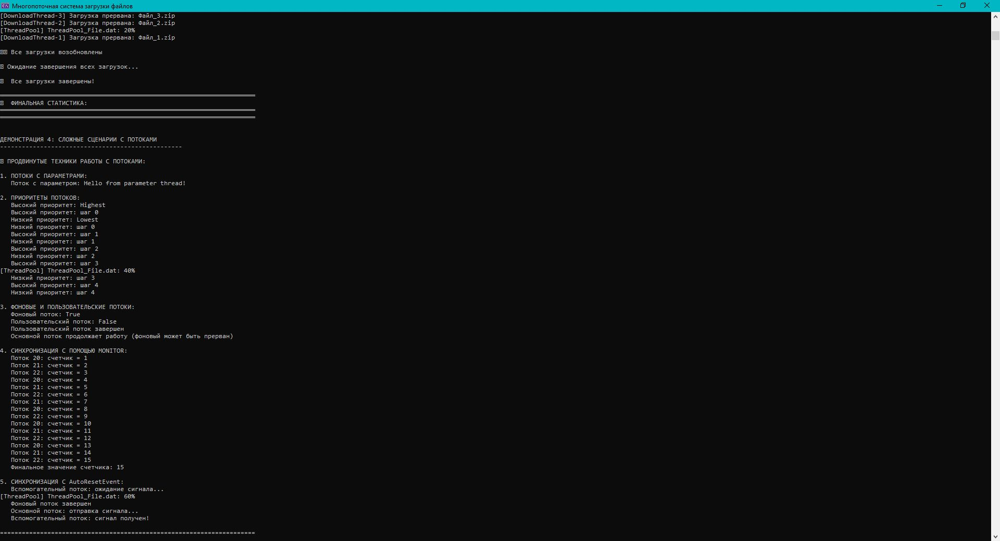

# Практическая работа 9. Создание и управление потоками в .NET.
## Вариант 15 Создать поток, который имитирует прогресс загрузки от 0 до 100%.


Цель близ
Научиться создавать и запускать потоки на C#.
Освоить методы управления потоками (приостановка, возобновление, завершение).
Изучить синхронизацию потоков для предотвращения возникновения проблем при доступе к общим ресурсам.

### Код решения (Program.cs)

```csharp
using System;
using System.Threading;
using System.Collections.Concurrent;
using System.Linq;

namespace ThreadProgressDemo
{
    /// <summary>
    /// Класс, представляющий задачу загрузки с прогрессом
    /// </summary>
    public class DownloadTask
    {
        public int Id { get; }
        public string Name { get; }
        public int Progress { get; private set; }
        public bool IsCompleted { get; private set; }
        public DateTime StartTime { get; }
        public DateTime? EndTime { get; private set; }
        public TimeSpan Duration => (EndTime ?? DateTime.Now) - StartTime;

        public DownloadTask(int id, string name)
        {
            Id = id;
            Name = name;
            Progress = 0;
            IsCompleted = false;
            StartTime = DateTime.Now;
        }

        public void UpdateProgress(int progress)
        {
            Progress = Math.Clamp(progress, 0, 100);
            if (Progress == 100)
            {
                IsCompleted = true;
                EndTime = DateTime.Now;
            }
        }
    }

    /// <summary>
    /// Менеджер загрузок с многопоточностью
    /// </summary>
    public class DownloadManager
    {
        private readonly object _lockObject = new object();
        private readonly ConcurrentDictionary<int, DownloadTask> _tasks = new();
        private readonly ConcurrentDictionary<int, Thread> _threads = new();
        private readonly Random _random = new Random();
        private bool _isRunning = true;

        /// <summary>
        /// Запуск нескольких загрузок параллельно
        /// </summary>
        public void StartMultipleDownloads(int count)
        {
            Console.WriteLine($"🚀 Запуск {count} параллельных загрузок...\n");

            for (int i = 1; i <= count; i++)
            {
                var task = new DownloadTask(i, $"Файл_{i}.zip");
                _tasks.TryAdd(i, task);

                // Создание и запуск потока для каждой загрузки
                var thread = new Thread(() => DownloadFile(task));
                thread.Name = $"DownloadThread-{i}";
                _threads.TryAdd(i, thread);
                thread.Start();

                Thread.Sleep(100); // Небольшая задержка между запусками потоков
            }
        }

        /// <summary>
        /// Метод, выполняемый в потоке для имитации загрузки файла
        /// </summary>
```
